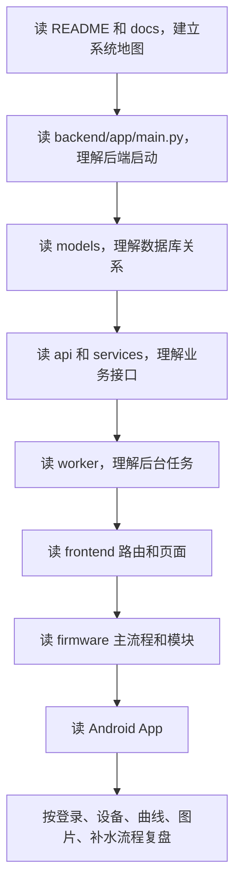

# SmartPot 项目从零阅读指南

> 目标：帮助你从完全不熟悉代码的状态，逐步读懂这个智能盆栽系统的架构、核心流程和答辩重点。

## 一、先建立整体地图

不要一开始就钻进某个函数。这个项目是多端系统，先记住四个部分：

```text
firmware/   ESP32-S3 固件，负责采集、拍照、补水、上传和接收命令
backend/    FastAPI 后端，负责认证、设备、数据、图片、识别、告警和控制
frontend/   React Web 管理端，负责设备监控、图片、曲线、告警和植物管理
android/    Android App，负责移动端查看和操作
```

建议先把下面这条链路背熟：

```text
ESP32-S3 采集数据 -> 上传到后端 -> 后端入库/分析/推送 -> Web 和 App 展示 -> 用户或自动策略下发命令 -> ESP32 执行水泵/拍照
```

这是整个项目最重要的主线。

## 二、推荐阅读顺序

### 第 0 步：先看项目说明和目录

先读：

- `README.md`
- `AGENTS.md`
- `docs/` 目录下已有接口、部署、固件或设计说明

这一阶段不要急着理解所有代码，只需要搞清楚：

- 系统有哪些端。
- 每一端负责什么。
- 设备数据怎么传。
- 图片怎么传。
- 用户在哪里登录。
- 病害检测在哪里执行。

可以运行这些命令快速看目录：

```bash
rg --files backend/app frontend/src firmware/src firmware/include android/app/src/main/java docs
```

## 三、第一重点：先读后端

后端是整个系统的中心。设备、Web、App 都围绕后端接口工作，所以建议从后端开始。

### 1. 启动入口

先读：

- `backend/app/main.py`

重点看：

- FastAPI 应用如何创建。
- 启动时做了哪些初始化。
- 是否初始化数据库。
- 是否启动 MQTT、图片处理、自动补水、定时拍照等后台任务。
- `/static/images` 如何挂载，用于展示图片。

读完这个文件，你应该能回答：“后端服务启动后，后台有哪些常驻任务在运行？”

### 2. 路由入口

继续读：

- `backend/app/api/router.py`
- `backend/app/api/auth.py`
- `backend/app/api/devices.py`
- `backend/app/api/telemetry.py`
- `backend/app/api/images.py`
- `backend/app/api/alerts.py`
- `backend/app/api/plant_types.py`
- `backend/app/api/control.py`

重点不是背每个接口，而是知道每类接口在哪里：

- 登录注册在 `auth.py`
- 设备列表、详情、绑定在 `devices.py`
- 传感器历史数据在 `telemetry.py`
- 图片上传、检测、删除在 `images.py`
- 告警中心在 `alerts.py`
- 植物品种增删改查在 `plant_types.py`
- 补水、拍照等控制命令在 `control.py`

### 3. 认证和数据库依赖

读：

- `backend/app/dependencies.py`
- `backend/app/core/security.py`
- `backend/app/core/database.py`

重点理解：

- JWT 如何解析当前用户。
- 后端如何校验设备属于当前用户。
- 数据库会话如何创建。
- 开发环境 SQLite 如何自动建表和迁移。

答辩中如果老师问“如何防止用户访问别人的设备”，答案就在这一层。

### 4. 数据模型

读：

- `backend/app/models/user.py`
- `backend/app/models/device.py`
- `backend/app/models/telemetry.py`
- `backend/app/models/image.py`
- `backend/app/models/detection.py`
- `backend/app/models/alert.py`
- `backend/app/models/command.py`
- `backend/app/models/watering_event.py`
- `backend/app/models/plant_type.py`

建议画一张关系图：

```text
User -> Device -> Telemetry
              -> Image -> Detection
              -> Alert
              -> Command
              -> WateringEvent
Device -> PlantType
```

重点字段：

- `Device.device_id`
- `Device.status`
- `Device.last_seen_at`
- `Device.plant_type`
- `Telemetry.soil_moisture`
- `Image.image_url`
- `Image.enhanced_url`
- `Image.detection_source`
- `Detection.confidence`
- `Alert.severity`
- `PlantType.soil_moisture_min`

### 5. 业务服务层

读：

- `backend/app/services/device_service.py`
- `backend/app/services/telemetry_service.py`
- `backend/app/services/command_service.py`
- `backend/app/services/image_service.py`
- `backend/app/services/detection_service.py`
- `backend/app/services/image_preprocess_service.py`
- `backend/app/services/plant_type_service.py`
- `backend/app/services/alert_service.py`

重点理解这些问题：

- 设备列表如何附带在线状态和缩略图。
- 遥测数据如何入库和查询历史曲线。
- 控制命令如何创建、下发和确认。
- 图片上传后如何进入检测流程。
- 图像增强、质量评分和模型推理如何串起来。
- 植物阈值如何影响自动补水。
- 删除图片时如何同步删除检测结果和告警。

### 6. 后台任务

读：

- `backend/app/worker/telemetry_consumer.py`
- `backend/app/worker/image_processor.py`
- `backend/app/worker/auto_watering.py`
- `backend/app/worker/photo_scheduler.py`

重点理解：

- 遥测 worker 如何消费设备数据。
- 图片 worker 如何处理待检测图片。
- 自动补水 worker 如何根据阈值和湿度触发命令。
- 定时拍照 worker 如何调度设备拍照。

这一部分是答辩中的重点，因为它能体现系统不是“点按钮查数据库”，而是有后台自动处理能力。

## 四、第二重点：读前端

前端负责把后端能力组织成用户可操作的界面。

### 1. 前端入口和路由

读：

- `frontend/src/main.tsx`
- `frontend/src/App.tsx`

重点看路由：

- `/` 设备概览。
- `/devices/:deviceId` 设备详情。
- `/images` 图片和病害记录。
- `/images/:imageId` 图片详情。
- `/alerts` 告警中心。
- `/plants` 植物品种管理。
- `/login` 登录。
- `/register` 注册。

### 2. 登录状态

读：

- `frontend/src/contexts/AuthContext.tsx`
- `frontend/src/hooks/useAuth.ts`
- `frontend/src/components/ProtectedRoute.tsx`

重点理解：

- token 存在哪里。
- 页面刷新后如何恢复登录状态。
- 未登录用户为什么会跳到登录页。

### 3. API 封装

读：

- `frontend/src/api/client.ts`
- `frontend/src/api/auth.ts`
- `frontend/src/api/devices.ts`
- `frontend/src/api/telemetry.ts`
- `frontend/src/api/images.ts`
- `frontend/src/api/alerts.ts`
- `frontend/src/api/plants.ts`
- `frontend/src/api/control.ts`

重点看 `client.ts`：

- Axios 基础路径。
- 请求拦截器如何带 token。
- 响应拦截器如何处理统一响应格式。

### 4. 核心页面

重点读：

- `frontend/src/pages/Dashboard.tsx`
- `frontend/src/pages/DeviceDetail.tsx`
- `frontend/src/pages/ImageGallery.tsx`
- `frontend/src/pages/ImageDetail.tsx`
- `frontend/src/pages/Alerts.tsx`
- `frontend/src/pages/PlantTypes.tsx`

建议按功能读：

- 设备概览：设备卡片、在线状态、缩略图、告警数量。
- 设备详情：传感器数据、历史曲线、日期选择、一周曲线、补水控制、图片。
- 图片页面：病害检测结果、增强图、质量评分、删除图片。
- 告警中心：告警列表、筛选和状态。
- 植物品种：新增、修改、删除、阈值设置。

### 5. WebSocket

读：

- `frontend/src/hooks/useWebSocket.ts`

重点理解：

- 前端如何连接后端 WebSocket。
- 断线后如何重连。
- 页面如何根据推送事件刷新状态。

## 五、第三重点：读固件

固件是设备真实运行的部分。答辩中老师可能会问引脚、传感器、补水、拍照和通信。

### 1. 引脚和配置

先读：

- `firmware/include/board_pins.h`
- `firmware/include/config.h`

重点记住：

- 摄像头 OV2640 引脚不能改。
- 水泵 GPIO47。
- DHT11 GPIO21。
- BH1750 SDA=GPIO41，SCL=GPIO42。
- 土壤湿度 ADC GPIO1。
- Mock 模式通过 `MOCK_MODE` 控制。

### 2. 固件主流程

读：

- `firmware/src/main.cpp`

重点看：

- `setup()` 初始化了哪些模块。
- `loop()` 周期性做哪些事情。
- WiFi、MQTT、HTTP server、传感器、自动补水、日志是如何被调度的。

读完后你应该能描述：

```text
设备上电 -> 连接 WiFi -> 初始化传感器/摄像头/水泵 -> 启动 HTTP 接口 -> 周期采集并上传 -> 接收命令 -> 自动补水或拍照
```

### 3. 各模块服务

继续读：

- `firmware/src/wifi_manager.cpp`
- `firmware/src/sensor_service.cpp`
- `firmware/src/camera_service.cpp`
- `firmware/src/pump_service.cpp`
- `firmware/src/http_server.cpp`
- `firmware/src/upload_service.cpp`
- `firmware/src/mqtt_service.cpp`
- `firmware/src/runtime_config.cpp`
- `firmware/src/mock_service.cpp`

重点理解：

- WiFi 如何自动重连。
- 传感器如何读取并转换为百分比。
- 摄像头如何初始化和拍照。
- 水泵如何开关和定时运行。
- HTTP 接口如何用于局域网发现和控制。
- MQTT 如何接收命令。
- 后端植物阈值如何同步到设备运行配置。
- Mock 模式如何返回模拟值。

## 六、第四重点：读 Android App

Android 端主要体现移动端交互和复用后端接口。

读：

- `android/app/src/main/java/com/smartpot/app/MainActivity.kt`
- `android/app/src/main/java/com/smartpot/app/data/SmartPotApi.kt`
- `android/app/src/main/java/com/smartpot/app/data/ApiModels.kt`

重点理解：

- App 如何登录。
- token 如何保存。
- 设备、告警、植物三个底部模块如何切换。
- 设备卡片如何进入详情页。
- App 和 Web 是否共用同一套后端 API。

## 七、按业务流程反向阅读

当你已经知道目录后，建议按流程读代码。这样比逐个文件读更容易形成系统理解。

### 流程 1：用户登录

阅读顺序：

```text
frontend Login 页面
-> frontend/src/api/auth.ts
-> backend/app/api/auth.py
-> backend/app/core/security.py
-> backend/app/models/user.py
```

要理解：

- 用户名密码如何提交。
- 后端如何校验密码。
- JWT 如何生成。
- 前端如何保存 token。

### 流程 2：设备概览

阅读顺序：

```text
frontend/src/pages/Dashboard.tsx
-> frontend/src/api/devices.ts
-> backend/app/api/devices.py
-> backend/app/services/device_service.py
-> backend/app/models/device.py
```

要理解：

- 设备卡片数据来自哪里。
- 在线状态如何计算。
- 缩略图从哪里来。
- 告警数量如何显示。

### 流程 3：历史曲线

阅读顺序：

```text
frontend/src/pages/DeviceDetail.tsx
-> frontend/src/api/telemetry.ts
-> backend/app/api/telemetry.py
-> backend/app/services/telemetry_service.py
-> backend/app/models/telemetry.py
```

要理解：

- 日期选择如何传给后端。
- 单日曲线和一周曲线如何查询。
- 后端如何按时间范围返回数据。

### 流程 4：图片上传和病害检测

阅读顺序：

```text
firmware/src/camera_service.cpp
-> firmware/src/upload_service.cpp
-> backend/app/api/images.py
-> backend/app/services/image_service.py
-> backend/app/worker/image_processor.py
-> backend/app/services/image_preprocess_service.py
-> backend/app/services/detection_service.py
-> frontend/src/pages/ImageDetail.tsx
```

要理解：

- 图片如何从设备到后端。
- 图片为什么先进入待检测状态。
- 后台 worker 如何异步处理。
- 原图、增强图、标注图分别是什么。
- 检测结果如何展示。

### 流程 5：自动补水

阅读顺序：

```text
frontend/src/pages/PlantTypes.tsx
-> backend/app/api/plant_types.py
-> backend/app/services/plant_type_service.py
-> backend/app/worker/auto_watering.py
-> backend/app/services/command_service.py
-> firmware/src/mqtt_service.cpp
-> firmware/src/pump_service.cpp
```

要理解：

- 植物品种阈值在哪里配置。
- 设备如何知道当前植物的阈值。
- 什么情况下触发补水。
- 水泵如何执行。
- 补水事件如何记录。

### 流程 6：删除图片

阅读顺序：

```text
frontend/src/pages/ImageGallery.tsx
-> frontend/src/api/images.ts
-> backend/app/api/images.py
-> backend/app/services/image_service.py
-> backend/app/models/image.py
-> backend/app/models/detection.py
-> backend/app/models/alert.py
```

要理解：

- 删除图片时不只是删除图片文件。
- 还要删除关联检测结果和相关告警。
- 前端删除成功后如何刷新列表。

## 八、运行和验证命令

### 后端

```bash
cd backend
pip install -e .
python -m uvicorn app.main:app --reload --host 0.0.0.0 --port 8000
pytest
```

### 前端

注意：当前环境中 npm 需要在 D 盘目录下运行。

```bash
cd frontend
npm install
npm run dev
npm run build
npx tsc --noEmit
```

### 固件

```bash
cd firmware
python -m platformio run
python -m platformio run -t upload -t monitor
```

### Android

```bash
cd android
./gradlew assembleDebug
```

Windows PowerShell 下可以用：

```powershell
cd android
.\gradlew.bat assembleDebug
```

## 九、答辩前必须读懂的重点

优先读懂这些内容：

1. 整体架构：设备、后端、Web、App 如何协作。
2. 数据上传流程：传感器数据如何进入数据库并显示成曲线。
3. 在线状态机制：为什么用 `last_seen_at` 判断设备是否离线。
4. 自动补水流程：植物阈值、土壤湿度、水泵命令之间的关系。
5. 图片检测流程：上传、增强、ONNX 推理、检测结果、告警展示。
6. 设备绑定思路：局域网 WiFi 发现比手动设备编号更适合当前项目。
7. 植物品种管理：为什么要支持新增、修改、删除和阈值配置。
8. Mock 模式：无硬件情况下如何提前开发和联调。

## 十、不要一开始就读的内容

以下内容可以放到后面：

- CSS 细节。
- UI 动画和样式变量。
- 每个 Pydantic 字段的完整定义。
- 每个 Android Composable 的布局细节。
- 第三方库内部实现。
- 所有日志格式。

先读业务流程，再补细节。否则容易在页面样式或工具函数里迷路。

## 十一、推荐学习路线图



## 十二、读代码时建议记录的问题

每读完一个模块，尝试回答：

- 这个模块接收什么输入？
- 输出什么结果？
- 依赖哪些其他模块？
- 失败时如何处理？
- 和数据库哪张表有关？
- 和前端哪个页面有关？
- 答辩时老师可能会问什么？

如果这些问题都能回答出来，说明你不是只看了代码，而是真的理解了系统。

## 十三、最终目标

读完项目后，你应该能不用看代码讲清楚这几条链路：

```text
登录认证链路
设备在线状态链路
传感器数据上报链路
历史曲线查询链路
图片上传和病害检测链路
自动补水控制链路
告警生成和展示链路
植物品种阈值配置链路
```

答辩时最重要的不是背出所有文件名，而是能说明“为什么这样设计、数据怎么流动、异常怎么处理、还有哪些不足和改进方向”。

